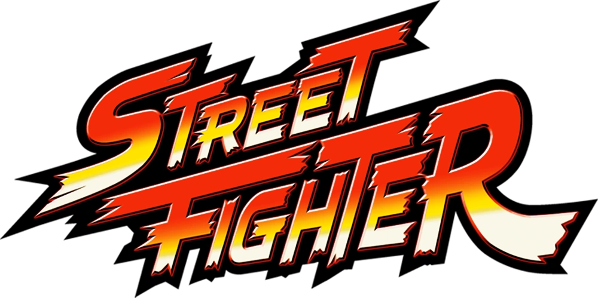

# street-fighter

## Arciga Morales Abraham Israel 22310169

## Descripción
Street Fighter (SFML) es un proyecto de juego de lucha básico desarrollado con la biblioteca SFML (Simple and Fast Multimedia Library). Este programa permite a los jugadores controlar dos personajes, Ryu y Ken, moverse por una ventana de juego y disfrutar de música de fondo mientras exploran el entorno.

## Instalación
Para ejecutar este proyecto, sigue los siguientes pasos:

1. Instalar SFML:
- Asegúrate de tener SFML instalado en tu sistema. Puedes descargar SFML desde sfml-dev.org y seguir las instrucciones de instalación según tu sistema operativo.

2. Clonar el Repositorio:
- Clona este repositorio en tu máquina local:

git clone https://github.com/tuusuario/street-fighter-sfml.git

3. Compilar y Ejecutar:
- Abre el proyecto en tu IDE preferido que soporte C++ y SFML (como Visual Studio, Code::Blocks, etc.).
- Configura el proyecto para que enlace con las bibliotecas SFML y compílalo.
- Ejecuta el juego desde el IDE o desde la línea de comandos.

## Controles
- Ryu:
    - Movimiento: A (izquierda), D (derecha), W (arriba), S (abajo).

- Ken:
    - Movimiento: Flechas del teclado (izquierda, derecha, arriba, abajo).
## Funcionalidades
- Movimiento de Personajes: Ambos personajes pueden moverse por la ventana de juego utilizando las teclas especificadas.
- Música de Fondo: El juego reproduce música de fondo desde el archivo "sF.ogg".
- Interfaz Gráfica: Incluye un fondo de juego y un texto estático que dice "STREET FIGHTER!".

## Créditos
Este proyecto fue creado por Aldo Misael Osuna Rodriguez Y Arantza Lia Sanchez Orozco. Modificado y mejorado por Abraham Israel Arciga Morales. Utiliza la biblioteca SFML para la representación gráfica y de sonido.

